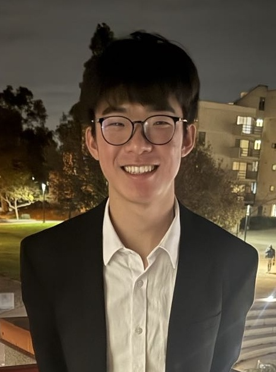
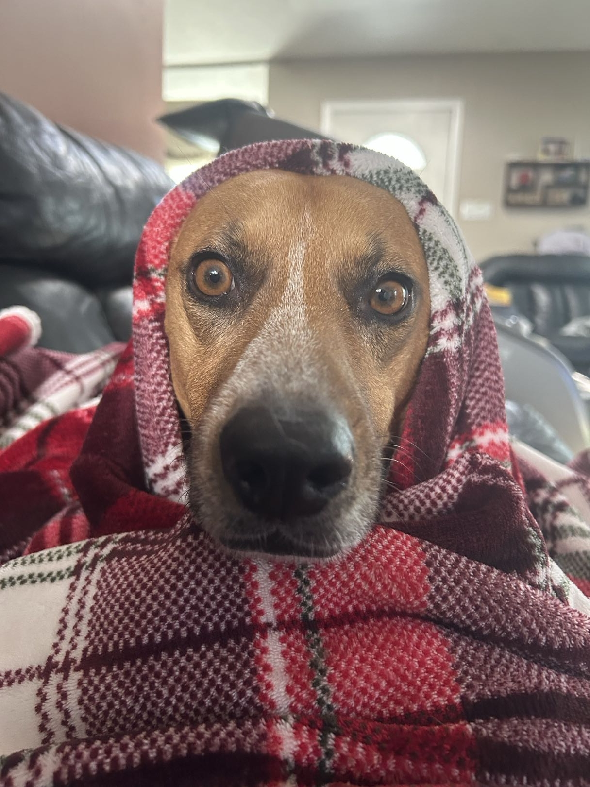

# Raiden Louie
## Table of contents
- [Who I am](#who-i-am)
- [My motto](#my-motto)
- [Technical Skills](#technical-skills)
- [Projects](#projects)
- [Connect with me](#connect-with-me)
- [Other interests](#other-interests)
### Who I am
Hello! I am a second-year Computer Science & Cognitive Behavioral Neuroscience major interested in the intersection between the human brain and digital systems.

### My Motto
> "One who thinks, thinks too much." (Raiden Louie, 2026)

### Technical skills 
- Python
- Java
- C++

### Projects
- EEG Analysis of Neural Responses to Music Genre: A Comparison of Classical and EDM

Code Snippet from our Power Spectral Density analysis tests
<pre>
# Calculate PSD with 0.5s windows and 50% overlap
psds = epochs.compute_psd(
    method='welch', 
    n_fft=256,        # Keep n_fft at 256 for better frequency resolution
    n_per_seg=125,    # 0.5 seconds
    n_overlap=62,     # 0.25 seconds
    fmin=8, 
    fmax=30
)
psd_data = psds.get_data() # (Trials, Channels, Freqs)
</pre>

### Connect with me
- [Email Me](mailto:raidenlouie@gmail.com)
- [GitHub](https://github.com/RaideNaeNae)
- [LinkedIn](https://www.linkedin.com/in/raiden-louie/)
### Other interests
1. My dog, 
3. TV
4. Music